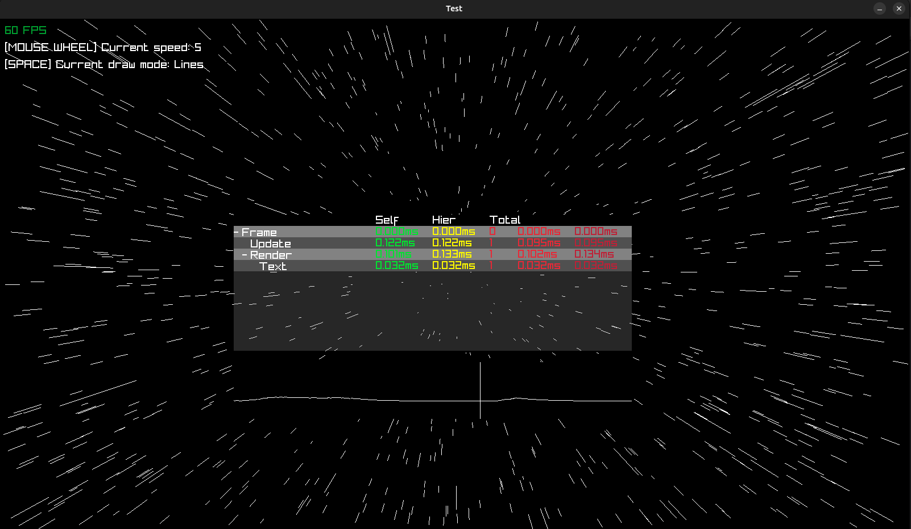

# Raylib + Zig profiler

Mainly for personal use. If you find any need for it, feel free to use the code however you want.

This tool is dependent of raylib-zig since it uses a graphics layer for rendering. So, make sure to install [that](https://github.com/raylib-zig/raylib-zig) first and do the configuration.

What it can do:
* CPU profiling
* Memory allocation timeline
* Memory leak report
* Performance graph

Download and install profiler as a dependency by running the command in the root of your project directory:

```bash
zig fetch --save git+https://github.com/cherishthejoy/ray-zig-profiler
```

In `build.zig`
```zig
const profile_dep = b.dependency("profile", .{
    .target = target,
    .optimize = optimize,
});

const profile = profile_dep.module("profile");
```

And then:
```zig
exe.root_module.addImport("profile", profile);
```

Make sure to link and add the import for use otherwise, the profiler yells at you for not being able to find raylib-zig
```zig
mod.linkLibrary(raylib_artifact);
mod.addImport("raylib", raylib);
mod.addImport("profile", profile);
```

See the examples directory to see how to pass the profiler and use it in different scopes

Usage: 
```zig
const std = @import("std");

const rl = @import("raylib");
const pr = @import("profile");

// Define zones to profile
const Zones = enum {
    Frame,
    Render,
};

// Configuration
const Profiler = pr.Profiler(Zones, .{});

pub fn main() anyerror!void {
    const screenWidth = 1600;
    const screenHeight = 900;

    var arena = std.heap.ArenaAllocator.init(std.heap.page_allocator);
    defer _ = arena.deinit();
    
    // Wrap an allocator and produces a profiling allocator
    var prof_alloc = pr.ProfAllocator.init(arena.allocator());
    const allocator = prof_alloc.allocator();

    // Timeline and leak report
    defer prof_alloc.reportAllocation();
    defer prof_alloc.reportTimeline();
    
    // Totally up for you to use the profiling allocator or any allocator
    const prof = try Profiler.init(allocator, .Frame);
    defer prof.deinit();

    rl.initWindow(screenWidth, screenHeight, "Basic text rendering");
    defer rl.closeWindow();

    rl.setTargetFPS(60);

    while (!rl.windowShouldClose()) {
        // Reset stats every frame
        prof.nextFrame();
            
        // Start the defined zone
        prof.startZone(.Render);
        rl.beginDrawing();
        defer rl.endDrawing();

        rl.clearBackground(.white);

        rl.drawText("Press [TAB] to open the profiling window", 190, 200, 20, .light_gray);
            
        // End the defined zone
        prof.endZone();
        // Draw the profiler GUI
        try prof.draw();
    }
}
```



```bash
=== Allocation Timeline ===
[0.015ms] + 62864 bytes (50 nodes)
[12330.463ms] -62864 bytes freed
[0.050ms] + 240 bytes
[12330.461ms] -240 bytes freed
---------------------------------------
Peak: 63104 bytes at 0.064ms
Final: 0 bytes | Total allocated: 63104 bytes

=== Leak Report ===
[0] 62864 bytes - freed
[1] 240 bytes - freed
---------------------------
```

Note to self: Do tests, optimize.
